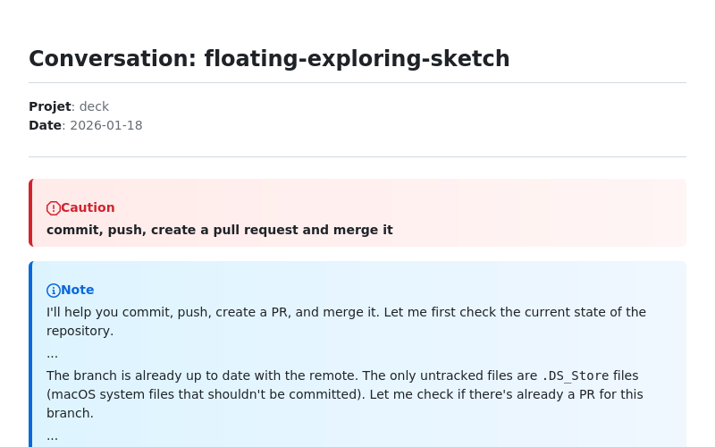
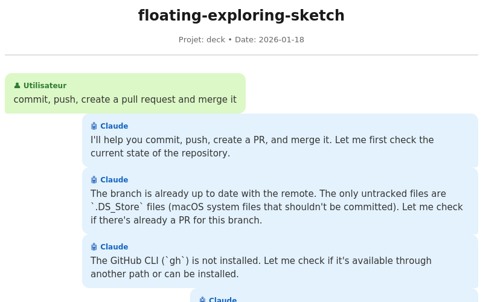

# conversation-export

Outil CLI pour exporter les conversations Claude Code en Markdown ou HTML.

## Description

`conversation-export` permet de :
- Naviguer dans l'historique des conversations Claude Code via une interface TUI
- Lister toutes les conversations disponibles
- Exporter une conversation en Markdown (avec alertes GitHub) ou HTML (style chat)

## Prérequis

- macOS / Linux
- `jq` (parsing JSON) - requis
- `fzf` (recherche floue) - optionnel mais recommandé

### Installation des dépendances

```bash
# jq (requis)
brew install jq

# fzf (optionnel - active la recherche floue)
brew install fzf
```

## Installation

```bash
# Le script est déjà exécutable
./conversation-export

# Ou ajoutez-le à votre PATH
ln -s "$(pwd)/conversation-export" /usr/local/bin/
```

## Utilisation

### Mode interactif

```bash
./conversation-export
```

**Avec fzf** (si installé) :
- Tapez pour filtrer les conversations (recherche floue)
- `↑/↓` : Naviguer dans les résultats
- `Enter` : Exporter la conversation sélectionnée
- `Ctrl+C` : Quitter

**TUI intégré** (sans fzf ou avec `--no-fzf`) :
- `↑/↓` ou `k/j` : Naviguer dans la liste
- `Enter` : Exporter la conversation sélectionnée
- `Page Up/Down` : Navigation rapide
- `q` : Quitter

```bash
# Forcer le TUI intégré même si fzf est installé
./conversation-export --no-fzf
```

### Lister les conversations

```bash
./conversation-export -l
./conversation-export --list
```

Affiche toutes les conversations avec leur numéro, date, projet et titre.

### Exporter une conversation spécifique

```bash
# Export Markdown vers un fichier auto-nommé (<slug>.md)
./conversation-export -e 3

# Export vers un fichier spécifique
./conversation-export -e 3 -o ma-conversation.md

# Export avec les blocs de code inclus
./conversation-export -e 3 --with-code

# Export vers stdout
./conversation-export -e 3 -o -
```

### Export HTML

```bash
# Export HTML avec style chat
./conversation-export -e 3 -f html

# Export HTML vers un fichier spécifique
./conversation-export -e 3 -f html -o ma-conversation.html

# Mode interactif avec export HTML
./conversation-export -f html
```

### Filtrer par projet

```bash
./conversation-export --project ClaudeToolBox
./conversation-export -l --project deck
```

## Options

| Option | Description |
|--------|-------------|
| (aucune) | Mode interactif (fzf si disponible, sinon TUI) |
| `-l, --list` | Liste les conversations (sans interactivité) |
| `-e, --export <id>` | Exporte la conversation numéro `<id>` |
| `-o, --output <file>` | Fichier de sortie (défaut: `<slug>.md/html`, `-` pour stdout) |
| `-f, --format <fmt>` | Format de sortie: `md` ou `html` (défaut: `md`) |
| `--with-code` | Inclut les blocs de code (défaut: texte seul) |
| `--project <name>` | Filtre par nom de projet |
| `--no-fzf` | Force le TUI intégré (désactive fzf) |
| `--max-output-lines <N>` | Limite de lignes pour les outputs (défaut: 30) |
| `--include-agents` | Inclure les résultats d'agents (défaut: exclus) |
| `--show-outputs` | Afficher les outputs (défaut: masqués avec "...") |
| `-h, --help` | Affiche l'aide |
| `-v, --version` | Affiche la version |

## Formats de sortie

### Markdown (`-f md`, défaut)

Le fichier Markdown utilise les alertes GitHub pour distinguer les interlocuteurs :

```markdown
# Conversation: titre-de-la-conversation

**Projet**: NomDuProjet
**Date**: 2026-01-18

---

> [!CAUTION]
> #### Message de l'utilisateur...

> [!NOTE]
> Réponse de Claude...
>
> ...
>
> Suite de la réponse...
```

- Messages utilisateur : bloc `[!CAUTION]` (fond rouge sur GitHub)
- Réponses Claude : bloc `[!NOTE]` (fond bleu sur GitHub)
- Outputs d'outils : masqués par `...` (ou affichés avec `--show-outputs`)

### HTML (`-f html`)

Le HTML utilise un style chat avec bulles de conversation :

- Format A4 optimisé pour l'impression via navigateur
- Messages utilisateur : alignés à gauche, fond vert clair (#DCF8C6)
- Messages Claude : alignés à droite, fond bleu clair (#E3F2FD)
- Outputs d'outils : complètement masqués

> [!TIP]
> Pour générer un PDF, ouvrez le fichier HTML dans un navigateur et utilisez Imprimer → Enregistrer en PDF.

## Structure des données Claude Code

Les conversations sont stockées dans :
```
~/.claude/projects/<chemin-projet-encodé>/<session-id>.jsonl
```

Chaque fichier `.jsonl` contient une ligne JSON par événement :
- `type: "user"` - Message de l'utilisateur
- `type: "assistant"` - Réponse de Claude
- `type: "progress"` - Événements de progression
- `type: "file-history-snapshot"` - Snapshots de fichiers

## Exemples

Le répertoire `examples/` contient des snapshots de conversations exportées dans les deux formats :

### Markdown : [`floating-exploring-sketch.md`](examples/floating-exploring-sketch.md)

Export Markdown utilisant les alertes GitHub :
- Messages utilisateur en bloc `[!CAUTION]` (fond rouge)
- Réponses Claude en bloc `[!NOTE]` (fond bleu)
- Outputs d'outils masqués par `...`



### HTML : [`floating-exploring-sketch.html`](examples/floating-exploring-sketch.html)

Export HTML avec style chat (bulles de conversation) :
- Messages utilisateur : alignés à gauche, fond vert clair (#DCF8C6)
- Messages Claude : alignés à droite, fond bleu clair (#E3F2FD)
- Format A4 optimisé pour l'impression/PDF via navigateur



## Limitations

- Les pensées de Claude (`thinking`) sont exclues
- Les appels d'outils (`tool_use`) sont exclus
- Seul le contenu textuel est exporté (pas les images)
